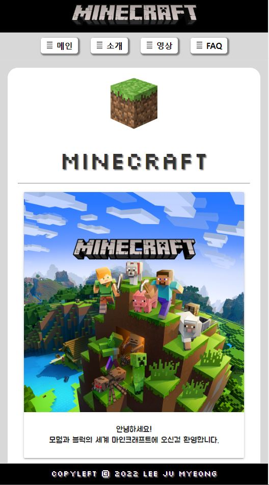

# 마인크래프트 소개 모바일 웹
### 취지 및 링크
> 마인크래프트을 좋아하여, 주제로 삼고 간단한 것이라도 좋으니 CSSFrameWork을 페이지 당 하나씩 적용하는 모바일 웹을 제작해보자라는 취지로 시작하게 되었습니다.   

> [github주소](https://ljmroqortk.github.io/LJM_Minecraft_portpolio.github.io/)   
> [netlify주소](https://dynamic-paprenjak-51b778.netlify.app)

### 짧은 소개

>  CSSFrameWork을 끌고와서 마인크래프트의 내부 구성 상품 소개와 FNQ으로 제작하고 나머지는 마인크래프트을 소개하는 영상을 걸고 임의 인원 수를 표시하는 그래프로 표현하였습니다.   
